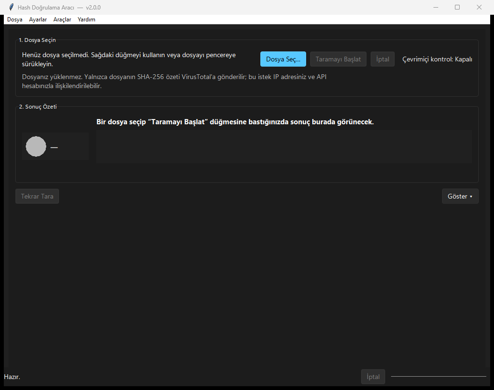

# Hash Verification Tool

A small, dependency-light Python tool for checking how trustworthy a
file is. Starting in v1.2 the main surface is a beginner-friendly
**"Güven Kontrolü"** screen that hashes a file, looks the hash up on
VirusTotal, checks the Windows digital signature, compares against a
local fingerprint and shows a plain-language risk summary — without
ever uploading the file. The original CLI and the **Gelişmiş** tools (now in
the **Araçlar** menu) keep all of v1.1's hash / verify / report power.

> **Status:** v2.1.0 — a single-page redesign with a modern Windows 11 look
> (Sun Valley). 634 passing unit tests, 0 skipped.



The whole application is one screen now: drop a file, read the verdict. History,
Settings and the power-user tools live in the **Araçlar** menu, and everything
technical on the main screen sits behind one **Göster** ("İleri") toggle.
Photographed through Win32 rather than recreated. The menu strip along the top
stays light because Windows draws it and ignores what Tk is told — a limitation
named here rather than cropped out.

---

## What is new in v2.1.0

The application became one screen. For a first-time user the whole surface is:
drop a file, read the verdict. Nothing was removed — everything technical moved
out of the way.

- **One screen instead of four tabs.** Güven Kontrolü fills the window;
  History, Settings and the Hash / Verify / Report power tools moved to the
  **Araçlar** menu, each opening in its own window.
- **The main screen hides what a beginner does not need.** The SHA-256
  fingerprint, the save/export buttons and the detail tabs sit behind one
  **Göster** ("İleri") toggle.
- **A modern Windows 11 look** via the Sun Valley theme (`sv-ttk`), while the
  app keeps the palette it measured for contrast. Optional: the GUI falls back
  to its own styling if `sv-ttk` is missing, and the build bundles it with
  `--collect-data sv_ttk`.
- **Logs persist** — moved to `%LOCALAPPDATA%\HashTool\logs` so a PyInstaller
  onefile build no longer loses them to a temporary directory.

See [CHANGELOG.md](CHANGELOG.md) under `[2.1.0]` for the full account.

## What is new in v2.0.0

The major number moves because the CLI contract changed, not because the
release is large: a script that ran `verify` against an unsigned manifest and
checked for exit `0` stops working here. [CHANGELOG.md](CHANGELOG.md) carries
the full account under `[2.0.0]`; the short version:

- **Signed manifests, end to end** — `keygen`, `sign`, `--sign-key`,
  `verify --trusted-key`, `inspect`. Private keys are encrypted with DPAPI on
  Windows, and the tool refuses to sign with a key stored where the manifest
  it signs will travel.
- **The GUI can do what the CLI can.** Signing from the Hash tab, a trusted
  key on the Verify tab, and one shared decision table so the graphical path
  is no longer the permissive one.
- **A scan you started can be stopped** — on the Trust Check screen and, from
  the status bar, on the Advanced tabs. Closing the window no longer leaves a
  manifest behind for a scan you walked away from.
- **The interface really is bilingual now.** The language menu used to
  translate the menu and leave every screen under it in Turkish. Everything
  the application says — including the risk verdict, the evidence rows and the
  exported reports — follows the choice. What stays Turkish is diagnostic text
  relaying what the OS or an API reported; that boundary is written down in
  `docs/P1-BACKLOG.md`.
- **Light and dark themes**, chosen from the Windows setting at startup, each
  with its own measured palette. Every colour clears WCAG AA against its own
  theme's hardest ground, and a test walks every widget in both to check that
  its text is readable against its own background.
- **Exit codes** `4` (manifest invalid), `5` (untrusted reference), `6`
  (incomplete scan), `7` (cancelled).

`dist/` now holds executables built from this source. They are checked as
executables rather than assumed to match:

```
python tools\verify_exe_smoke.py                 # CLI, twelve behaviours, source vs EXE
python tools\verify_exe_smoke.py --gui           # opens the window, reads its title, closes it
```

The previous build is kept beside them under `dist\eski-2026-05-24\` and is
worth a sentence, because it is the reason that harness exists. It answered
`--version` with the same string the current one does while having no
`keygen`, `sign` or `inspect` at all, accepting `--algo md5` without the
`--allow-insecure-algorithm` flag, and reporting a clean match against a
manifest whose origin could not be established. A version string that cannot
tell those two programs apart is not an identifier, so the harness now
requires an executable to report the version its source tree declares — and
running it against that old build is a supported mode
(`--teeth dist\eski-2026-05-24\HashTool.exe`), which currently rejects it in
10 of 12 scenarios.

Known limitations, stated rather than buried. **The release gate is not
reliably green**, in two separate ways, both recorded in `docs/P1-BACKLOG.md`
rather than silenced:

- roughly one run in ten trips over an unattributed `.tmp` file appearing
  during test cleanup (item 8);
- and about one round in eleven the test process does not fail — it *dies*,
  with Windows exit code `0xC0000409` and no `Ran N tests` summary (item 12).
  Two occurrences in twenty-two rounds, noticed while packaging v2.0.0 and
  dated to at least a day earlier by a temp directory a killed round left
  behind. It has not been explained, and shipping with an unexplained
  intermittent abort in the test process is a decision, not an oversight.

Neither has ever been observed affecting a hash, a verification verdict or a
signature check. Both are failures of the *test process*.

---

## What was new in v1.2.0

- **Güven Kontrolü tab** — pick one file, get a single Düşük / Orta /
  Yüksek risk badge plus a Turkish-first explanation.
- **VirusTotal hash lookup** (no file upload) — paste your free API key
  in the *Ayarlar* tab and the app queries `files/{sha256}` for you.
- **Authenticode signature check** on Windows via PowerShell — surfaces
  signer name without bundling a native PE parser.
- **Local fingerprint book** — remember a file's hash today, compare it
  later to see if it has been tampered with.
- **Risk engine + smart summary** — combines VT + signature + local
  results into one explainable score with auditable factor list.
- **Scan history** — last N runs persisted as JSON, double-click to
  re-scan.
- **JSON / HTML reports** — single-file shareable trust report.

The original *Advanced* tab still exposes Hash / Verify / Report and
all CLI subcommands (`hash`, `verify`, `report`) work unchanged.


That is what the same screen looked like at v1.2.0, kept for comparison: the
Windows 7-era chrome Tk reaches for by default, no accent on the primary
action, no cancel button, and nothing telling you what leaves the machine.

See [CHANGELOG.md](CHANGELOG.md) for v1.1 history.

---

## Features

- Hash a single file or recursively hash every file under a folder
- Algorithms: **MD5**, **SHA-1**, **SHA-256** (default: `sha256`), **SHA-512**
- Saves a structured **JSON manifest** with relative path, hash,
  algorithm, size and last-modified time per file
- Re-verifies a folder against an existing manifest and classifies
  every file as **unchanged / modified / new / missing / error**
- Exports the verification report as **JSON** or **CSV**
- Streams files in 64 KiB chunks so multi-GB files do not exhaust RAM
- Live progress reporting via a typed `ProgressEvent` callback (GUI
  progress bar, CLI `-v` debug lines, or your own consumer)
- Bilingual GUI (Türkçe / English) with on-the-fly language switch — the
  whole interface, the risk verdict and the exported reports, not just the menu
- Light and dark themes, taken from the Windows setting at startup, each with
  its own palette measured against WCAG AA
- Robust error handling: missing files, permission errors, broken
  manifests and I/O failures are reported, not crashed on
- Optional ANSI colour output (degrades gracefully if `colorama` is
  not installed or stdout is not a TTY)
- Lightweight logging to `logs/hash_tool.log`

---

## Project Layout

```
Hash Verification Tool/
├── main.py                       # CLI entry point (argparse)
├── gui_main.py                   # GUI entry point (thin wrapper)
├── core/
│   ├── __init__.py               # __version__ — the single source of it
│   ├── hash_utils.py             # Streamed hashing + ProgressEvent
│   ├── manifest_manager.py       # Folder manifest dataclass + JSON I/O
│   ├── manifest_signing.py       # Ed25519 sign / verify (cryptography)
│   ├── key_files.py              # Key file format, on disk
│   ├── secret_store.py           # DPAPI-backed secrets (API key, keys)
│   ├── atomic_io.py              # Write-then-rename; no half-written state
│   ├── scan_policy.py            # What a scan may touch, and why it skips
│   ├── scan_controller.py        # Cancellable scan driver
│   ├── task_runner.py            # Shared background task runner
│   ├── verifier.py               # Compare live folder vs manifest
│   ├── baseline.py               # Reference state a verify runs against
│   ├── reporter.py               # Console / JSON / CSV folder reports
│   ├── file_info.py              # Human-readable single-file metadata
│   ├── vt_client.py              # VirusTotal v3 hash lookup (no upload)
│   ├── signature_checker.py      # Windows Authenticode via PowerShell
│   ├── local_verify.py           # "Did this file change?" fingerprint store
│   ├── risk_engine.py            # Monotonic risk table (not a score)
│   ├── smart_summary.py          # Plain-language summary builder
│   ├── history_manager.py        # Last-N-scans JSON store
│   ├── i18n.py                   # TR / EN translation table (~385 keys)
│   ├── phrases.py                # Sentence identity + params, no words
│   ├── trust_report.py           # JSON + HTML trust report export
│   └── trust_pipeline.py         # Orchestrates the trust-check flow
├── gui/
│   ├── __init__.py
│   ├── app.py                    # Tk root + tab wiring + thread plumbing
│   ├── theme.py                  # Light / dark palettes and the chrome
│   ├── trust_presenter.py        # Verdict → what the screen shows
│   ├── i18n.py                   # Re-export shim over core.i18n
│   └── views/
│       ├── trust_check_view.py   # Main beginner-friendly screen
│       ├── history_view.py       # Scan history tab
│       └── settings_view.py      # VirusTotal / history / language tab
├── utils/
│   ├── __init__.py
│   ├── logger.py                 # Logging helper (GUI-safe)
│   └── settings.py               # JSON-backed settings + AppSettings
├── tests/                        # 632 unit tests, stdlib only, 0 skipped
├── tools/
│   ├── run_suite_gate.py         # N clean rounds or it is not green
│   ├── verify_fix_coverage.py    # Revert each fix, demand a test fails
│   └── verify_exe_smoke.py       # The EXE, checked as an EXE
├── demo.py                       # End-to-end legacy demo
├── build_exe.bat                 # Build + check dist/HashTool.exe (CLI)
├── build_gui_exe.bat             # Build + check dist/HashToolGUI.exe (GUI)
├── requirements.txt              # Runtime, all optional
├── requirements-dev.txt          # PyInstaller, pinned
├── CHANGELOG.md
├── LICENSE
└── README.md
```

---

## Installation

Developed and tested on **Python 3.12, Windows 11**. Nothing in the source
uses syntax newer than 3.10 (PEP 604 `|` unions are the newest thing in it),
so 3.10 and 3.11 should work — but no run has been made on them, and this
README would rather say that than imply a guarantee it has not tested.

Windows only, and not by accident: the key store is DPAPI, signature checking
is Authenticode, the theme is read from the registry and long-path handling
goes through Win32. Those are not thin shims over something portable.

```powershell
# 1. Clone or download the project, then:
cd "Hash Verification Tool"

# 2. (Recommended) create a virtualenv
python -m venv .venv
.venv\Scripts\activate

# 3. Install runtime dependencies (all optional but recommended)
pip install -r requirements.txt
```

Every package in `requirements.txt` is optional — the app falls back
to stdlib if any are missing. Installing them gives you `requests` for
faster VirusTotal calls, `windnd` for drag-and-drop and `colorama` for
coloured CLI output.

### Don't want to install Python?

Pre-built single-file Windows executables are published on the
**[GitHub Releases](../../releases)** page of this repository
(not committed into the repo itself — binary files belong in Releases).

| File                   | Purpose | Approx. size |
|------------------------|---------|--------------|
| `HashTool.exe`         | CLI     | ~12 MB       |
| `HashToolGUI.exe`      | GUI     | ~18 MB       |

They are **not code-signed**. Windows SmartScreen will warn the first time you
run either one, and that warning is correct: nothing about an unsigned binary
tells you who built it. Every release publishes SHA-256 digests so you can
check the file you downloaded is the file that was built — which is, after
all, what this tool is for.

Both are single-file PyInstaller builds — no installer, no registry
changes. Delete the file to uninstall.

---

## Running the GUI

### Option A — From source (Python)

```powershell
cd "Hash Verification Tool"
pip install -r requirements.txt   # one-time, optional but recommended
python gui_main.py
```

### Option B — From the pre-built EXE

After running `build_gui_exe.bat` (or downloading a release):

```powershell
dist\HashToolGUI.exe
```

You can also double-click `dist\HashToolGUI.exe` from File Explorer.
The EXE is self-contained — no Python install required on the target
machine. Settings and history are written next to the EXE
(`hashtool_settings.json`, `data\history.json`, `data\known_files.json`).

### First-run setup (both options)

1. Switch to the **Ayarlar** tab.
2. Get a free API key at <https://www.virustotal.com/gui/my-apikey>
   and paste it into the *API Anahtarı* field.
3. Click **Anahtarı Test Et** to confirm it works, then **Kaydet**.

You can use the app without a VirusTotal key — you just won't get the
malicious / suspicious engine counts; everything else (hash, signature,
local fingerprint) still works.

### How to scan a file

1. On the main screen click **Dosya Seç…** (or drag a file onto the window if
   `windnd` is installed).
2. Click **Taramayı Başlat**.
3. Read the risk badge (Düşük / Orta / Yüksek / Bilinmiyor) and the
   short summary at the top.
4. Click **Göster ▾** ("İleri") if you want the SHA-256 fingerprint, the
   save/export buttons and the full detail tabs (hashes, raw VirusTotal stats,
   signature details).
5. Optional next steps (under **Göster ▾**):
   - **Parmak İzini Kaydet** — remember this file's SHA-256 so the
     next scan will tell you if the file changed.
   - **Raporu Kaydet (JSON / HTML)** — export a shareable report.

A scan can be stopped while it runs: **İptal** next to **Taramayı Başlat**.
Cancellation is cooperative, so the button shows *İptal ediliyor…* until the
worker reaches its next stage — a VirusTotal or signature check already in
flight still has to return.

The other tools live in the **Araçlar** menu, each opening in its own window:

- **Geçmiş** — last N scans, double-click a row to re-run the check.
- **Ayarlar** — VirusTotal key (with **Anahtarı Kaldır** to delete a stored
  one), auto-query toggle, history limit, UI language.
- **Gelişmiş** — the original v1.1 Hash / Verify / Report tools for
  bulk folder integrity checks, now with the whole signing lifecycle:
  - **Hash** takes an *İmzalama anahtarı* and signs the folder manifest it
    writes, under the same placement rules the CLI enforces (the key may not
    live inside the scanned folder or beside the manifest).
  - **Doğrula** takes a *Güvenilen anahtar* — the same `.pub` file, private key
    file or raw hex that `--trusted-key` accepts — which is what lets the
    graphical path reach a verified-origin verdict rather than only "signed,
    source unverified".
  - The status bar has an **İptal** button for whichever of the three is
    running.

  Keys themselves are still created with `keygen` on the CLI.

---

## Usage — CLI

Six subcommands: `hash`, `verify`, `keygen`, `sign`, `inspect`, `report`.

```powershell
python main.py --help
python main.py hash --help
python main.py verify --help
```

Output is always UTF-8, whatever the console code page is, so a Turkish
Windows (cp1254) and a UTF-8 machine produce byte-identical output.

### 1. Hash a single file

```powershell
python main.py hash --file "C:\example\file.txt"
python main.py hash --file "C:\example\file.txt" --algo sha1
python main.py hash --file "C:\example\file.txt" --output single.json
```

Without `--output` you get a one-liner on stdout (`<algo>  <digest>  <path>`).
With `--output` you get the same line plus a manifest JSON. The file is read
**once** either way, so the digest you see and the one stored describe the
same bytes. `--output` pointing at the file being hashed is refused.

### 2. Hash an entire folder

```powershell
python main.py hash --folder "C:\example_folder" --output manifest.json
python main.py -v hash --folder "C:\example_folder" --output manifest.json
python main.py hash --folder "C:\example_folder" --output m.json --follow-symlinks
```

The folder is walked recursively. Symlinks and Windows junctions are **not**
followed by default; with `--follow-symlinks` they are, but a target that
resolves outside the folder is still skipped, and a directory link is followed
only when its target has not been walked yet — so links cannot send the scan
around a cycle. Real directories are always walked, so a link can never hide
the directory it points at. Content reached through a link is therefore listed
under both its real path and the link's path; both are paths that exist, and a
later `verify` of the same tree walks it the same way.

If any file cannot be read, the scan is **incomplete** and no manifest is
written to the given path — an incomplete reference would make every file it
missed verify as "unchanged" forever. Use `--write-partial` to get a clearly
named `<output>.partial.json` artefact instead. Exit code is `6`.

Building a manifest with MD5 or SHA-1 requires `--allow-insecure-algorithm`.

### 3. Sign a manifest (recommended)

An unsigned manifest proves nothing on its own: whoever can change the files
can change the reference too. Signing takes three commands.

```powershell
# 1. Create a keypair. Keep the private key OUTSIDE the folders you scan.
python main.py keygen --out "C:\Users\me\keys\signing.key"

# 2. Sign while hashing…
python main.py hash --folder "C:\data" --output "C:\baselines\m.json" `
                    --sign-key "C:\Users\me\keys\signing.key"

# …or sign a manifest you already have:
python main.py sign --manifest "C:\baselines\m.json" --key "C:\Users\me\keys\signing.key"

# 3. Verify against the public half.
python main.py verify --folder "C:\data" --manifest "C:\baselines\m.json" `
                      --trusted-key "C:\Users\me\keys\signing.key.pub"
```

On Windows the private key is encrypted with DPAPI, so a copied key file is
useless under another account or on another machine. `--portable` stores it as
plain hex when you genuinely need to move it — anyone who can read that file
can sign as you.

Rules the tool enforces, because breaking them makes the signature worthless:

- the signing key may not live inside the scanned folder or next to the
  manifest it signs — judged on the normalised path, so an extended-length
  (`\\?\`) spelling of the same location does not get around it;
- `keygen` never overwrites an existing key, and removes anything it created
  if the pair cannot be written completely;
- an incomplete scan is never signed;
- `sign --force` replaces a signature only if the existing one still verifies.
  One that no longer checks out means the content changed after it was signed,
  and re-signing would put your key behind that change.

Distribute `signing.key.pub` **separately** from the manifest. A public key
that arrives with the manifest proves nothing: whoever forged one forged both.
Without `--trusted-key`, a signed manifest can only be checked against its own
embedded key — that shows internal consistency, not origin.

`--trusted-key` also accepts a private key file, and then derives the public
half from the key material rather than reading the file's `public_key` field.
That field is not covered by the DPAPI encryption, so trusting it would let
anyone who can edit the file nominate their own key as the one you trust.

### 4. Verify a folder against a manifest

```powershell
python main.py verify --folder "C:\data" --manifest m.json --trusted-key signing.key.pub
python main.py verify --folder "C:\data" --manifest m.json --allow-unsigned
python main.py verify --folder "C:\data" --manifest m.json --allow-unsigned --show-details
python main.py verify --folder "C:\data" --manifest m.json --allow-unsigned --report report.csv
```

An unverifiable reference exits `5` unless you consciously pass
`--allow-unsigned`; the JSON report records that choice as
`policy_accepted`.

Exit codes are CI-friendly:

| Code | Meaning |
|------|---------|
| `0` | folder matches the manifest |
| `1` | differences detected (modified / new / missing / errors) |
| `2` | bad arguments, or a refused request (see the message) |
| `3` | unrecoverable failure (folder missing, unreadable input) |
| `4` | the manifest is corrupt or its schema is unsupported |
| `5` | the reference could not be trusted (unsigned / signature broken) |
| `6` | the scan could not cover the whole folder |
| `7` | cancelled |

### 5. Inspect a manifest without scanning

```powershell
python main.py inspect --manifest m.json
python main.py inspect --manifest m.json --trusted-key signing.key.pub
```

Prints schema, coverage, algorithm and signature state. Unlike `verify` it
will also *describe* a manifest whose signature is broken instead of refusing
to speak about it — which is exactly the manifest you most need explained.

### 6. Convert a saved JSON report to CSV (or vice versa)

```powershell
python main.py report --input report.json --format csv
python main.py report --input report.json --format csv --output report.csv
```

### 7. Quick end-to-end demo

```powershell
python demo.py
```

`demo.py` builds a small folder under `demo_data/`, hashes it,
deliberately tampers with it, then re-verifies — so you can see all
five status categories light up in one run.

---

## Manifest Format

Manifests are plain JSON, easy to diff in version control:

```json
{
  "metadata": {
    "schema_version": "1.0",
    "tool_version": "2.0.0",
    "created_at": "2026-04-20T12:34:56+00:00",
    "algorithm": "sha256",
    "root_path": "C:/example_folder",
    "integrity_mode": "ed25519",
    "file_count": 3,
    "complete": true,
    "skipped_count": 0,
    "skipped": [],
    "errors": []
  },
  "entries": {
    "docs/readme.txt": {
      "hash": "9f86d081...",
      "algorithm": "sha256",
      "size": 1024,
      "mtime": 1714478096.512
    }
  },
  "signature": {
    "algorithm": "ed25519",
    "public_key": "…",
    "signature": "…"
  }
}
```

Paths are always stored with forward slashes so the same manifest can
be verified on Windows and POSIX systems.

`complete` must be a real JSON boolean and must agree with `skipped` /
`errors`; it is part of the signed payload, so an incomplete manifest cannot
be edited into a complete-looking one. `integrity_mode` is `none` for an
unsigned manifest and `ed25519` for a signed one — a `signature` block with
`integrity_mode: none` is treated as tampering, not as a stray field. The
`signature` key is absent entirely on unsigned manifests.

---

## Progress callback (for embedders)

Both `build_manifest_for_folder` and `Verifier.verify` accept an
optional `on_progress` callback so a host application can render a
progress bar, and a `cancel` predicate polled before each file:

```python
from core.hash_utils import ProgressEvent, ScanState
from core.manifest_manager import build_manifest_for_folder

def on_progress(ev: ProgressEvent) -> None:
    if ev.is_terminal:
        print(f"finished: {ev.state.value}  {ev.percent:.0f}%")
    else:
        print(f"[{ev.done}/{ev.total}] {ev.percent:5.1f}%  {ev.path}")

build = build_manifest_for_folder(
    "C:/example_folder", algorithm="sha256",
    on_progress=on_progress, cancel=lambda: user_pressed_stop,
)
```

The contract you can rely on:

- `total` is fixed for the whole run. It comes from the same file list the
  loop iterates, so `done` can never overshoot it.
- `done` only ever increases.
- **Exactly one** terminal event is emitted, always last, carrying
  `ScanState.COMPLETED`, `ScanState.CANCELLED` or `ScanState.FAILED`. An empty
  folder still gets one — otherwise a UI would have no moment at which to stop
  the spinner — and so does a scan that dies on an exception, which is emitted
  before the exception is re-raised. Branch on `ev.is_terminal`, not on a
  two-way COMPLETED/CANCELLED test, or a failed scan leaves the spinner up.
- `percent` is forced to `100.0` only on `COMPLETED`. A `CANCELLED` or
  `FAILED` event carries the partial ratio it actually reached.

A cancelled build is never `complete`, and `BuildResult.save()` refuses to
write it: a scan that stopped at an arbitrary file is a prefix of the folder
with no marker saying where it stops.

---

## Why SHA-256 by default?

- **Collision-resistant in practice.** No public collisions exist for
  SHA-256, while MD5 has been broken since 2004 and SHA-1 since 2017
  (Google's SHAttered).
- **Standardised.** SHA-256 is part of NIST's SHA-2 family and is the
  baseline integrity primitive used by TLS certificates, Bitcoin,
  Linux package managers, Git's modern object format and most
  forensic tools.
- **Fast enough.** On modern CPUs the bottleneck is disk I/O, not
  hashing.

### When *might* you still want MD5 / SHA-1?

Only for **non-security-critical** parity checks — comparing a backup
to its source on a trusted system, deduplicating files, etc. Both are
considered cryptographically broken and **must not** be used to prove
that a file was not tampered with by an adversary.

The tool keeps MD5 and SHA-1 available so you can validate downloads
that still publish those legacy checksums, but the default is
deliberately the safe choice, and building a *reference manifest* with
either one is gated:

- the CLI requires `--allow-insecure-algorithm`;
- the GUI asks for an explicit confirmation and defaults to "no";
- the verification result carries `collision_prone_algorithm: true`, never
  reports `trusted_match`, and prints a caveat next to the outcome.

Printing a bare checksum needs no opt-in — that is not an integrity claim.

---

## Building the executables yourself

Run the matching `.bat` file from the project root:

```powershell
# GUI (no console window) — produces dist\HashToolGUI.exe (~18 MB)
build_gui_exe.bat

# CLI (legacy advanced tools) — produces dist\HashTool.exe (~12 MB)
build_exe.bat
```

Both scripts:
- use `.venv\Scripts\python.exe` when it exists rather than whatever `python`
  PATH happens to resolve to — a bundle is built from the interpreter that
  runs PyInstaller, so the wrong one quietly produces an EXE without the
  dependencies,
- install PyInstaller on first run if it is missing
  (`requirements-dev.txt` pins the range),
- clean previous build artefacts,
- emit a single-file EXE under `dist\`,
- **and then check it**, because a build that succeeded is not the same claim
  as a program that works. The CLI script runs the twelve-scenario
  differential; the GUI script opens the window and reads its title. Either
  one failing fails the build.

Neither script passes `--hidden-import`. The GUI build used to pass fifteen of
them, justified by a comment about "dynamically loaded" view modules — there
are no dynamic imports anywhere in this source. Building with and without the
flags produces bundles holding the identical set of 510 modules, `requests`,
`windnd` and `colorama` included, because PyInstaller reads imports inside
functions and `try`/`except` blocks too. To re-check that after a refactor,
build twice and diff `build\HashToolGUI\PYZ-00.toc`.

After building the GUI, double-click `dist\HashToolGUI.exe` to launch
the app. Delete the EXE to uninstall — there is no installer and no
registry footprint.

---

## Running the tests

```powershell
python -m unittest discover -s tests -v
```

The test suite is pure standard library — no extra dependencies
needed. 23 tests covering hashing, manifest round-trip, verifier
classification, `count_files`, `ProgressEvent.percent` and the
progress-callback behaviour on both folder hashing and verification.

---

## Roadmap

Two entries that used to sit here — signed Ed25519 manifests and drag-and-drop
in the GUI — shipped in v2.0.0 and have been removed rather than left looking
like plans. A third, "macOS / Linux builds, the code is already
platform-agnostic", was removed because it stopped being true: see the
Installation section.

- Parallel hashing for huge folders (process pool)
- Glob-based include / exclude rules (`--exclude "*.tmp"`)
- HMAC mode for keyed integrity verification
- Watch mode (`--watch`) using `watchdog`
- Code signing, so the SmartScreen warning above can go away honestly
- CI that runs on its own. `.github/workflows/gate.yml` exists and runs the
  gate on a Windows runner, but only when started by hand — a gate is several
  full suite runs by definition, and on a private repository Windows minutes
  bill at twice the wall-clock, so a push trigger would spend the month's
  allowance on every commit whether or not anyone wanted an answer:

  ```powershell
  gh workflow run gate.yml -f rounds=10
  ```

  Ten rounds is the interesting number: the two intermittent failures below
  appear at roughly one round in ten, and the runner is the only machine
  available that is not this desk. It also reports whether it can create a
  file symlink, which this desktop cannot — that is what leaves backlog item 7
  unverified.

---

## License

Released under the [MIT License](LICENSE). No warranty — verify before
relying on it for anything safety-critical.
