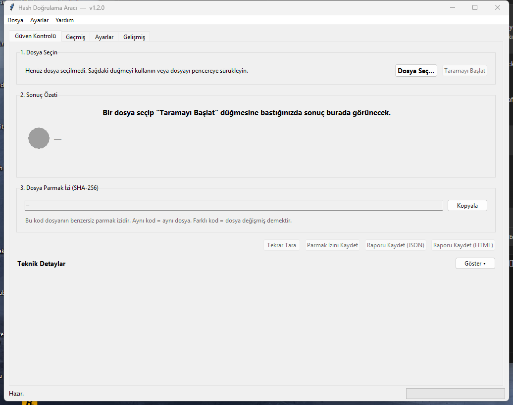

# Hash Verification Tool

A small, dependency-light Python tool for checking how trustworthy a
file is. Starting in v1.2 the main surface is a beginner-friendly
**"Güven Kontrolü"** screen that hashes a file, looks the hash up on
VirusTotal, checks the Windows digital signature, compares against a
local fingerprint and shows a plain-language risk summary — without
ever uploading the file. The original CLI and the **Advanced** tab
keep all of v1.1's hash / verify / report power.

> **Status:** v1.2.0 — stable. New trust-check workflow, history,
> settings tab. 37 passing unit tests.



---

## What's new in v1.2.0

- **Güven Kontrolü tab** — pick one file, get a single Düşük / Orta /
  Yüksek risk badge plus a Turkish-first explanation.
- **VirusTotal hash lookup** (no file upload) — paste your free API key
  in the *Ayarlar* tab and the app queries `files/{sha256}` for you.
- **Authenticode signature check** on Windows via PowerShell — surfaces
  signer name without bundling a native PE parser.
- **Local fingerprint book** — remember a file's hash today, compare it
  later to see if it has been tampered with.
- **Risk engine + smart summary** — combines VT + signature + local
  results into one explainable score with auditable factor list.
- **Scan history** — last N runs persisted as JSON, double-click to
  re-scan.
- **JSON / HTML reports** — single-file shareable trust report.

The original *Advanced* tab still exposes Hash / Verify / Report and
all CLI subcommands (`hash`, `verify`, `report`) work unchanged.

See [CHANGELOG.md](CHANGELOG.md) for v1.1 history.

---

## Features

- Hash a single file or recursively hash every file under a folder
- Algorithms: **MD5**, **SHA-1**, **SHA-256** (default: `sha256`), **SHA-512**
- Saves a structured **JSON manifest** with relative path, hash,
  algorithm, size and last-modified time per file
- Re-verifies a folder against an existing manifest and classifies
  every file as **unchanged / modified / new / missing / error**
- Exports the verification report as **JSON** or **CSV**
- Streams files in 64 KiB chunks so multi-GB files do not exhaust RAM
- Live progress reporting via a typed `ProgressEvent` callback (GUI
  progress bar, CLI `-v` debug lines, or your own consumer)
- Bilingual GUI (Türkçe / English) with on-the-fly language switch
- Robust error handling: missing files, permission errors, broken
  manifests and I/O failures are reported, not crashed on
- Optional ANSI colour output (degrades gracefully if `colorama` is
  not installed or stdout is not a TTY)
- Lightweight logging to `logs/hash_tool.log`

---

## Project Layout

```
Hash Verification Tool/
├── main.py                       # CLI entry point (argparse)
├── gui_main.py                   # GUI entry point (thin wrapper)
├── core/
│   ├── __init__.py
│   ├── hash_utils.py             # Streamed hashing + ProgressEvent
│   ├── manifest_manager.py       # Folder manifest dataclass + JSON I/O
│   ├── verifier.py               # Compare live folder vs manifest
│   ├── reporter.py               # Console / JSON / CSV folder reports
│   ├── file_info.py              # Human-readable single-file metadata
│   ├── vt_client.py              # VirusTotal v3 hash lookup (no upload)
│   ├── signature_checker.py      # Windows Authenticode via PowerShell
│   ├── local_verify.py           # "Did this file change?" fingerprint store
│   ├── risk_engine.py            # Düşük / Orta / Yüksek risk scoring
│   ├── smart_summary.py          # Plain-Turkish summary builder
│   ├── history_manager.py        # Last-N-scans JSON store
│   ├── trust_report.py           # JSON + HTML trust report export
│   └── trust_pipeline.py         # Orchestrates the trust-check flow
├── gui/
│   ├── __init__.py
│   ├── app.py                    # Tk root + tab wiring + thread plumbing
│   ├── i18n.py                   # TR / EN translation table
│   └── views/
│       ├── trust_check_view.py   # Main beginner-friendly screen
│       ├── history_view.py       # Scan history tab
│       └── settings_view.py      # VirusTotal / history / language tab
├── utils/
│   ├── __init__.py
│   ├── logger.py                 # Logging helper (GUI-safe)
│   └── settings.py               # JSON-backed settings + AppSettings
├── tests/                        # 37 unit tests, stdlib only
├── demo.py                       # End-to-end legacy demo
├── build_exe.bat                 # Build dist/HashTool.exe (CLI)
├── build_gui_exe.bat             # Build dist/HashToolGUI.exe (GUI)
├── requirements.txt
├── CHANGELOG.md
├── LICENSE
└── README.md
```

---

## Installation

Requires **Python 3.10+** (uses PEP 604 `|` type unions and modern
typing). Tested on Windows 11.

```powershell
# 1. Clone or download the project, then:
cd "Hash Verification Tool"

# 2. (Recommended) create a virtualenv
python -m venv .venv
.venv\Scripts\activate

# 3. Install runtime dependencies (all optional but recommended)
pip install -r requirements.txt
```

Every package in `requirements.txt` is optional — the app falls back
to stdlib if any are missing. Installing them gives you `requests` for
faster VirusTotal calls, `windnd` for drag-and-drop and `colorama` for
coloured CLI output.

### Don't want to install Python?

Pre-built single-file Windows executables are published on the
**[GitHub Releases](../../releases)** page of this repository
(not committed into the repo itself — binary files belong in Releases).

| File                   | Purpose | Approx. size |
|------------------------|---------|--------------|
| `HashTool.exe`         | CLI     | ~8 MB        |
| `HashToolGUI.exe`      | GUI     | ~12 MB       |

Both are single-file PyInstaller builds — no installer, no registry
changes. Delete the file to uninstall.

---

## Running the GUI

### Option A — From source (Python)

```powershell
cd "Hash Verification Tool"
pip install -r requirements.txt   # one-time, optional but recommended
python gui_main.py
```

### Option B — From the pre-built EXE

After running `build_gui_exe.bat` (or downloading a release):

```powershell
dist\HashToolGUI.exe
```

You can also double-click `dist\HashToolGUI.exe` from File Explorer.
The EXE is self-contained — no Python install required on the target
machine. Settings and history are written next to the EXE
(`hashtool_settings.json`, `data\history.json`, `data\known_files.json`).

### First-run setup (both options)

1. Switch to the **Ayarlar** tab.
2. Get a free API key at <https://www.virustotal.com/gui/my-apikey>
   and paste it into the *API Anahtarı* field.
3. Click **Anahtarı Test Et** to confirm it works, then **Kaydet**.

You can use the app without a VirusTotal key — you just won't get the
malicious / suspicious engine counts; everything else (hash, signature,
local fingerprint) still works.

### How to scan a file

1. **Güven Kontrolü** tab → click **Dosya Seç…** (or drag a file onto
   the window if `windnd` is installed).
2. Click **Taramayı Başlat**.
3. Read the risk badge (Düşük / Orta / Yüksek / Bilinmiyor) and the
   short summary at the top.
4. Click **Teknik Detaylar → Göster ▾** if you want the full hashes,
   raw VirusTotal stats and signature details.
5. Optional next steps:
   - **Parmak İzini Kaydet** — remember this file's SHA-256 so the
     next scan will tell you if the file changed.
   - **Raporu Kaydet (JSON / HTML)** — export a shareable report.

The other top-level tabs:

- **Geçmiş** — last N scans, double-click a row to re-run the check.
- **Ayarlar** — VirusTotal key, auto-query toggle, history limit, UI
  language.
- **Gelişmiş** — the original v1.1 Hash / Verify / Report tools for
  bulk folder integrity checks.

---

## Usage — CLI

Six subcommands: `hash`, `verify`, `keygen`, `sign`, `inspect`, `report`.

```powershell
python main.py --help
python main.py hash --help
python main.py verify --help
```

Output is always UTF-8, whatever the console code page is, so a Turkish
Windows (cp1254) and a UTF-8 machine produce byte-identical output.

### 1. Hash a single file

```powershell
python main.py hash --file "C:\example\file.txt"
python main.py hash --file "C:\example\file.txt" --algo sha1
python main.py hash --file "C:\example\file.txt" --output single.json
```

Without `--output` you get a one-liner on stdout (`<algo>  <digest>  <path>`).
With `--output` you get the same line plus a manifest JSON. The file is read
**once** either way, so the digest you see and the one stored describe the
same bytes. `--output` pointing at the file being hashed is refused.

### 2. Hash an entire folder

```powershell
python main.py hash --folder "C:\example_folder" --output manifest.json
python main.py -v hash --folder "C:\example_folder" --output manifest.json
python main.py hash --folder "C:\example_folder" --output m.json --follow-symlinks
```

The folder is walked recursively. Symlinks and Windows junctions are **not**
followed by default; with `--follow-symlinks` they are, but a target that
resolves outside the folder is still skipped, and a directory link is followed
only when its target has not been walked yet — so links cannot send the scan
around a cycle. Real directories are always walked, so a link can never hide
the directory it points at. Content reached through a link is therefore listed
under both its real path and the link's path; both are paths that exist, and a
later `verify` of the same tree walks it the same way.

If any file cannot be read, the scan is **incomplete** and no manifest is
written to the given path — an incomplete reference would make every file it
missed verify as "unchanged" forever. Use `--write-partial` to get a clearly
named `<output>.partial.json` artefact instead. Exit code is `6`.

Building a manifest with MD5 or SHA-1 requires `--allow-insecure-algorithm`.

### 3. Sign a manifest (recommended)

An unsigned manifest proves nothing on its own: whoever can change the files
can change the reference too. Signing takes three commands.

```powershell
# 1. Create a keypair. Keep the private key OUTSIDE the folders you scan.
python main.py keygen --out "C:\Users\me\keys\signing.key"

# 2. Sign while hashing…
python main.py hash --folder "C:\data" --output "C:\baselines\m.json" `
                    --sign-key "C:\Users\me\keys\signing.key"

# …or sign a manifest you already have:
python main.py sign --manifest "C:\baselines\m.json" --key "C:\Users\me\keys\signing.key"

# 3. Verify against the public half.
python main.py verify --folder "C:\data" --manifest "C:\baselines\m.json" `
                      --trusted-key "C:\Users\me\keys\signing.key.pub"
```

On Windows the private key is encrypted with DPAPI, so a copied key file is
useless under another account or on another machine. `--portable` stores it as
plain hex when you genuinely need to move it — anyone who can read that file
can sign as you.

Rules the tool enforces, because breaking them makes the signature worthless:

- the signing key may not live inside the scanned folder or next to the
  manifest it signs — judged on the normalised path, so an extended-length
  (`\\?\`) spelling of the same location does not get around it;
- `keygen` never overwrites an existing key, and removes anything it created
  if the pair cannot be written completely;
- an incomplete scan is never signed;
- `sign --force` replaces a signature only if the existing one still verifies.
  One that no longer checks out means the content changed after it was signed,
  and re-signing would put your key behind that change.

Distribute `signing.key.pub` **separately** from the manifest. A public key
that arrives with the manifest proves nothing: whoever forged one forged both.
Without `--trusted-key`, a signed manifest can only be checked against its own
embedded key — that shows internal consistency, not origin.

`--trusted-key` also accepts a private key file, and then derives the public
half from the key material rather than reading the file's `public_key` field.
That field is not covered by the DPAPI encryption, so trusting it would let
anyone who can edit the file nominate their own key as the one you trust.

### 4. Verify a folder against a manifest

```powershell
python main.py verify --folder "C:\data" --manifest m.json --trusted-key signing.key.pub
python main.py verify --folder "C:\data" --manifest m.json --allow-unsigned
python main.py verify --folder "C:\data" --manifest m.json --allow-unsigned --show-details
python main.py verify --folder "C:\data" --manifest m.json --allow-unsigned --report report.csv
```

An unverifiable reference exits `5` unless you consciously pass
`--allow-unsigned`; the JSON report records that choice as
`policy_accepted`.

Exit codes are CI-friendly:

| Code | Meaning |
|------|---------|
| `0` | folder matches the manifest |
| `1` | differences detected (modified / new / missing / errors) |
| `2` | bad arguments, or a refused request (see the message) |
| `3` | unrecoverable failure (folder missing, unreadable input) |
| `4` | the manifest is corrupt or its schema is unsupported |
| `5` | the reference could not be trusted (unsigned / signature broken) |
| `6` | the scan could not cover the whole folder |
| `7` | cancelled |

### 5. Inspect a manifest without scanning

```powershell
python main.py inspect --manifest m.json
python main.py inspect --manifest m.json --trusted-key signing.key.pub
```

Prints schema, coverage, algorithm and signature state. Unlike `verify` it
will also *describe* a manifest whose signature is broken instead of refusing
to speak about it — which is exactly the manifest you most need explained.

### 6. Convert a saved JSON report to CSV (or vice versa)

```powershell
python main.py report --input report.json --format csv
python main.py report --input report.json --format csv --output report.csv
```

### 7. Quick end-to-end demo

```powershell
python demo.py
```

`demo.py` builds a small folder under `demo_data/`, hashes it,
deliberately tampers with it, then re-verifies — so you can see all
five status categories light up in one run.

---

## Manifest Format

Manifests are plain JSON, easy to diff in version control:

```json
{
  "metadata": {
    "schema_version": "1.0",
    "tool_version": "1.2.0",
    "created_at": "2026-04-20T12:34:56+00:00",
    "algorithm": "sha256",
    "root_path": "C:/example_folder",
    "integrity_mode": "ed25519",
    "file_count": 3,
    "complete": true,
    "skipped_count": 0,
    "skipped": [],
    "errors": []
  },
  "entries": {
    "docs/readme.txt": {
      "hash": "9f86d081...",
      "algorithm": "sha256",
      "size": 1024,
      "mtime": 1714478096.512
    }
  },
  "signature": {
    "algorithm": "ed25519",
    "public_key": "…",
    "signature": "…"
  }
}
```

Paths are always stored with forward slashes so the same manifest can
be verified on Windows and POSIX systems.

`complete` must be a real JSON boolean and must agree with `skipped` /
`errors`; it is part of the signed payload, so an incomplete manifest cannot
be edited into a complete-looking one. `integrity_mode` is `none` for an
unsigned manifest and `ed25519` for a signed one — a `signature` block with
`integrity_mode: none` is treated as tampering, not as a stray field. The
`signature` key is absent entirely on unsigned manifests.

---

## Progress callback (for embedders)

Both `build_manifest_for_folder` and `Verifier.verify` accept an
optional `on_progress` callback so a host application can render a
progress bar, and a `cancel` predicate polled before each file:

```python
from core.hash_utils import ProgressEvent, ScanState
from core.manifest_manager import build_manifest_for_folder

def on_progress(ev: ProgressEvent) -> None:
    if ev.is_terminal:
        print(f"finished: {ev.state.value}  {ev.percent:.0f}%")
    else:
        print(f"[{ev.done}/{ev.total}] {ev.percent:5.1f}%  {ev.path}")

build = build_manifest_for_folder(
    "C:/example_folder", algorithm="sha256",
    on_progress=on_progress, cancel=lambda: user_pressed_stop,
)
```

The contract you can rely on:

- `total` is fixed for the whole run. It comes from the same file list the
  loop iterates, so `done` can never overshoot it.
- `done` only ever increases.
- **Exactly one** terminal event is emitted, always last, carrying
  `ScanState.COMPLETED`, `ScanState.CANCELLED` or `ScanState.FAILED`. An empty
  folder still gets one — otherwise a UI would have no moment at which to stop
  the spinner — and so does a scan that dies on an exception, which is emitted
  before the exception is re-raised. Branch on `ev.is_terminal`, not on a
  two-way COMPLETED/CANCELLED test, or a failed scan leaves the spinner up.
- `percent` is forced to `100.0` only on `COMPLETED`. A `CANCELLED` or
  `FAILED` event carries the partial ratio it actually reached.

A cancelled build is never `complete`, and `BuildResult.save()` refuses to
write it: a scan that stopped at an arbitrary file is a prefix of the folder
with no marker saying where it stops.

---

## Why SHA-256 by default?

- **Collision-resistant in practice.** No public collisions exist for
  SHA-256, while MD5 has been broken since 2004 and SHA-1 since 2017
  (Google's SHAttered).
- **Standardised.** SHA-256 is part of NIST's SHA-2 family and is the
  baseline integrity primitive used by TLS certificates, Bitcoin,
  Linux package managers, Git's modern object format and most
  forensic tools.
- **Fast enough.** On modern CPUs the bottleneck is disk I/O, not
  hashing.

### When *might* you still want MD5 / SHA-1?

Only for **non-security-critical** parity checks — comparing a backup
to its source on a trusted system, deduplicating files, etc. Both are
considered cryptographically broken and **must not** be used to prove
that a file was not tampered with by an adversary.

The tool keeps MD5 and SHA-1 available so you can validate downloads
that still publish those legacy checksums, but the default is
deliberately the safe choice, and building a *reference manifest* with
either one is gated:

- the CLI requires `--allow-insecure-algorithm`;
- the GUI asks for an explicit confirmation and defaults to "no";
- the verification result carries `collision_prone_algorithm: true`, never
  reports `trusted_match`, and prints a caveat next to the outcome.

Printing a bare checksum needs no opt-in — that is not an integrity claim.

---

## Building the executables yourself

Run the matching `.bat` file from the project root:

```powershell
# GUI (no console window) — produces dist\HashToolGUI.exe (~15 MB)
build_gui_exe.bat

# CLI (legacy advanced tools) — produces dist\HashTool.exe (~8 MB)
build_exe.bat
```

Both scripts:
- install PyInstaller on first run if it is missing,
- clean previous build artefacts,
- emit a single-file EXE under `dist\`.

After building the GUI, double-click `dist\HashToolGUI.exe` to launch
the app. Delete the EXE to uninstall — there is no installer and no
registry footprint.

Both scripts install PyInstaller on first run if it is missing and
clean up previous build artefacts before each build.

---

## Running the tests

```powershell
python -m unittest discover -s tests -v
```

The test suite is pure standard library — no extra dependencies
needed. 23 tests covering hashing, manifest round-trip, verifier
classification, `count_files`, `ProgressEvent.percent` and the
progress-callback behaviour on both folder hashing and verification.

---

## Roadmap (post-v1.1 ideas)

- Parallel hashing for huge folders (process pool)
- Glob-based include / exclude rules (`--exclude "*.tmp"`)
- HMAC mode for keyed integrity verification
- Signed manifests (Ed25519) for tamper-evident reports
- Watch mode (`--watch`) using `watchdog`
- Drag-and-drop support in the GUI
- macOS / Linux GUI builds (the code is already platform-agnostic;
  only the build scripts are Windows-specific)

---

## License

Released under the [MIT License](LICENSE). No warranty — verify before
relying on it for anything safety-critical.
